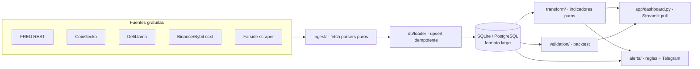

# Arquitectura y decisiones de diseño

Documento técnico del panel cripto-macro: cómo está construido y **por qué** se tomó cada
decisión. Sin datos personales ni de cartera — solo el sistema. Para instalar y ejecutar, ver
[README.md](README.md).

---

## 1. Objetivo y filosofía

Panel que ingiere datos **gratuitos**, calcula indicadores y responde **cuatro preguntas en orden**:

1. **¿Hay apetito por riesgo?** — macro (Fed, inflación, empleo, dólar).
2. **¿El rally tiene sustento o es mecánico?** — estructura de mercado (flujos ETF, OI, funding).
3. **¿La tesis del activo sigue viva?** — fundamentales del token (TVL, revenue, unlocks).
4. **¿Toca ejecutar según el plan?** — estado del DCA y reglas escritas.

Dos decisiones de diseño rectoras:

- **Pull, no push (anti-over-trading).** El mayor riesgo del proyecto no es técnico, es conductual:
  un panel en tiempo real empuja a mirar y mirar empuja a operar. No hay tickers en vivo,
  auto-refresh ni alertas de precio. Resolución diaria salvo justificación. Las alertas solo se
  disparan por condiciones accionables escritas de antemano.
- **Solo fuentes gratuitas.** Una cartera pequeña no puede pagar $50/mes en herramientas. Cualquier
  dato de pago se documenta como fuera de alcance y se busca alternativa gratuita.

## 2. Vista general del flujo

Capas (cada una testeable de forma aislada):

| Capa | Responsabilidad | Nota clave |
|---|---|---|
| `ingest/` | `fetch() -> DataFrame[source, series_id, ts, ts_release, value]` | Parsers **puros** + fixtures congelados; fallan ruidosamente si cambia el HTML/JSON. |
| `db/` | Esquema (formato largo) + upsert idempotente + lectura | `INSERT ... ON CONFLICT DO UPDATE`; adapter portable SQLite↔Postgres. |
| `transform/` | Indicadores como **funciones puras** + constructores de tabla | Sin red; entrada faltante → `None`, no excepción. |
| `validation/` | Backtest de señales (retornos forward + bootstrap) | Point-in-time, sin look-ahead. |
| `alerts/` | Reglas declarativas + Telegram | Dedup por evento/día; solo condiciones accionables. |
| `app/` | Dashboard Streamlit (5 secciones + showcase) | Pull, sin auto-refresh. |

## 3. Esquema de datos — formato largo

Una sola tabla de observaciones en **formato largo** `(source, series_id, ts, ts_release, value)`.
Añadir una serie nueva **no requiere migración de esquema**. `ts` = fecha de referencia del dato;
`ts_release` = fecha de publicación (crítico, ver §5). Tablas auxiliares: `events` (calendario),
`trades`, `dca_plan`, `exit_rules`, `alerts_log`.

**Idempotencia obligatoria:** todo upsert usa `ON CONFLICT DO UPDATE`. El pipeline se re-ejecuta
muchas veces al día; nunca debe duplicar. La clave primaria `(source, series_id, ts)` lo garantiza.

## 4. Decisiones técnicas notables

- **Point-in-time / anti look-ahead.** El CPI de junio se publica a mediados de julio. Asignarlo a
  "junio" en un backtest usa información del futuro. Por eso cada dato macro guarda `ts` **y**
  `ts_release`, y todo z-score/backtest usa solo la ventana anterior a cada fecha.
- **FRED sin `fredapi`.** Se usa el REST directo con `output_type=4` (initial release only) para
  fechas point-in-time. Las series diarias superan el límite de 2000 vintage dates por petición, así
  que se **bisecta la ventana real-time** de forma recursiva hasta quedar por debajo del límite.
- **Backend de DB portable.** Un adaptador fino (`db/database.py`) expone la interfaz de `sqlite3`
  sobre `psycopg`, seleccionado por la variable `DATABASE_URL`. Traduce placeholders (`?`→`%s`) y
  el `executescript`. El código de negocio no sabe qué backend hay debajo (SQLite local, Postgres
  gestionado en la nube).
- **Scraping frágil por diseño.** Los scrapers (flujos ETF) tienen parser puro testeado contra un
  **fixture HTML congelado**: si la estructura cambia, el test falla ruidosamente en CI en vez de
  emitir datos silenciosamente incorrectos.
- **Aislamiento de privacidad.** La ingesta a la DB pública usa `--public`, que **omite** la
  sincronización de la cuenta personal; el dashboard desplegado usa `PUBLIC_MODE=1`, que oculta la
  sección de cartera real. Las claves de cuenta nunca se despliegan.
- **pandas 3.0 / Altair.** Altair 6.2 no serializa un DataFrame de pandas 3.0 (inyecta cero filas).
  Los charts se construyen pasando registros pre-convertidos vía `alt.Data`. Las dependencias tienen
  cota superior por major para evitar que un `pip install` nuevo rompa el panel en silencio.

## 5. Metodología e indicadores

Todos los indicadores son funciones puras y testeadas. Los más relevantes:

- **Funding z-score** — `(x_t − media(V)) / desv(V)` sobre ventana móvil de 90 días, solo con la
  ventana anterior (point-in-time). `|z| ≥ 2` marca posicionamiento hacinado.
- **Estado del rally** — cuadrantes precio×interés-abierto: precio↑/OI↑ = convicción (dinero nuevo);
  precio↑/OI↓ = mecánico (cierre de cortos, frágil); etc.
- **Value accrual (concepto rector)** — dos ratios:
  - `MC/TVL` = valoración vs. capital bloqueado (proxy de actividad).
  - `MC/Revenue` (P/E cripto) = valoración vs. *revenue* que realmente llega al token (DefiLlama,
    anualizado). Un protocolo con mucho TVL pero **$0 de revenue** (sin fee switch) no tiene
    `MC/Revenue` — la señal más clara de "el token no captura valor".
- **Validación de señales** — retorno *forward* a 7/30/90 días desde cada fecha de señal vs. baseline
  de **fechas sin señal** (disjunto), con p-valor por **permutación**. El baseline disjunto evita
  comparar un subconjunto contra su propio superconjunto. Los z-scores son point-in-time. Los
  resultados se documentan **incluidos los que no funcionan** — ese es el punto.
- **DCA vs. baseline** — precio medio de entrada real vs. **DCA ciego** sobre la misma ventana de
  acumulación. El coste realizado de invertir un importe fijo por periodo es la **media armónica**
  de los precios (`n / Σ 1/p`), no la aritmética — usar la aritmética sesgaría el *edge*.
- **Tablero de invalidación** — semáforo por activo a partir de señales cuantitativas (salidas ETF
  sostenidas para BTC/ETH, caída de TVL, dilución, unlock próximo). Es **honesto** sobre lo que no
  puede medir: las invalidaciones cualitativas (demanda de token, riesgo regulatorio) se marcan como
  no medibles en vez de fingir un estado verde.

## 6. Trampas del dominio que el diseño evita

- **Look-ahead bias** — el error que invalida más backtests (ver §4/§5).
- **Overfitting** — validación fuera de muestra; desconfiar de reglas con muchos parámetros libres;
  no probar 50 variantes y quedarse con la mejor.
- **Discrepancia entre fuentes** — cada número documenta de qué proveedor sale; no se mezclan
  proveedores en una misma serie.
- **Rate limits** — endpoints batch, backoff exponencial, y un *backfill* histórico que reintenta y
  salta un activo ante un 429 (idempotente, se completa al re-ejecutar).

## 7. Calidad y despliegue

- **Tests** (`pytest`) obligatorios en parsers (con fixtures) y transformaciones; humo de render del
  dashboard con `AppTest`. **CI** (GitHub Actions) corre `ruff` + `pytest` en cada push.
- **Config externalizada** — activos, umbrales, ventanas e IDs en YAML; secretos solo en `.env`
  (ignorado por git). Nada hardcodeado.
- **Despliegue** — cron/systemd local escribe datos **públicos** en una Postgres gestionada; la app
  en Streamlit Community Cloud la lee en modo público. La cartera personal nunca sale de la máquina
  local.
