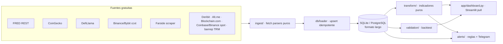

# cryptodash — Dashboard cripto-macro

[](https://github.com/juanbarmo10/portafolio_crypto/actions/workflows/ci.yml)

Panel personal de análisis cripto-macro con fuentes de datos **gratuitas**. Ingesta
macro (FRED), precios (CoinGecko) y TVL (DefiLlama) en SQLite, calcula indicadores
derivados y los presenta en Streamlit, con alertas por Telegram y un framework de
validación estadística de señales.

La **arquitectura y las decisiones de diseño** (capas, esquema, point-in-time, metodología de
indicadores y validación) están [más abajo](#arquitectura-y-decisiones-de-diseño). El contexto
operativo detallado con datos personales se mantiene en documentación interna, fuera del repositorio
público.

## Ejecutar el proyecto (resumen)

```bash
# 1. Entorno (una vez): crea el venv e instala todo (runtime + dashboard + mercados + dev).
python3 -m venv .venv && source .venv/bin/activate
pip install -e ".[dev,app,markets]"

# 2. Secretos (una vez): copia la plantilla y añade las claves que tengas.
cp config/.env.example config/.env    # FRED_API_KEY, BINANCE_API_KEY/SECRET (read-only), TELEGRAM_*

# 3. Ingesta: descarga datos de todas las fuentes a la DB (idempotente).
python run_ingest.py                  # o: python run_ingest.py --dry-run  (solo crea la DB)

# 4. Dashboard: abre el panel de 5 secciones (pull, sin auto-refresh).
./run_dashboard.sh                    # http://localhost:8501

# 5. Alertas: evalúa las reglas y envía a Telegram (dry-run si no hay bot).
python run_alerts.py                  # o --dry-run para solo loguear

# 6. Validación: informe honesto de backtest (retornos forward + bootstrap).
python run_validation.py

# 7. Todo en uno (para cron/systemd): ingesta -> alertas (+ validación los domingos).
./run_daily.sh                        # automatización diaria: ver deploy/README.md

# Tests + lint.
pytest && ruff check .
```

## Estado

**Fases 0-4 completadas; Fase 5 (análisis e interacción) en curso.** Integradas: ampliación de
fuentes gratuitas (**Parte A**), capa de análisis avanzado (**Parte B**: semáforo de régimen, drift,
riesgo de cartera, scorecard conductual, aporte mensual), asignador del DCA (**Parte G**), validación
ampliada con corrección FDR (**Parte C**) y una **capa fiscal opcional local** (lotes FIFO, PnL en dos
divisas, simulador de venta) — desactivada en el despliegue público.

Incluye hasta ahora:
- Estructura de paquetes (`core`, `ingest`, `db`, `transform`, `alerts`, `validation`, `app`).
- Configuración externalizada: `config/settings.yaml` (activos sección 5, umbrales, IDs verificados,
  metadatos de series FRED, categorías de tesis, exchanges de derivados, scraper ETF) y
  `config/assets_meta.yaml` (logos, descripciones y `next_unlock` por token).
- Esquema SQLite en formato largo (`db/schema.sql`) — portable a PostgreSQL/TimescaleDB.
- Loader idempotente (`db/loader.py`) con `INSERT ... ON CONFLICT DO UPDATE`.
- Ingesta multi-fuente: **FRED** (macro con `ts`/`ts_release` point-in-time), **CoinGecko**
  (snapshot + dominancia de mercado total), **DefiLlama** (TVL histórico), **derivados**
  (ccxt: funding, open interest, cierre del perp) y **flujos ETF** (scraper Farside).
- **Ampliación de fuentes gratuitas (Parte A):** todas sin coste y sin API key nueva.
  - **Nivel 1 (macro):** **liquidez neta de la Fed** (WALCL − TGA − RRP, FRED — el driver macro
    que cripto sigue más de cerca), **condiciones financieras** (NFCI, spread HY, real yield 10A,
    VIX), **stablecoins agregados** (DefiLlama — *dry powder*) y **Fear & Greed** (Alternative.me,
    como contexto contrarian).
  - **Nivel 2 (estructura):** **basis perp-spot**, **long/short retail vs. top** y **taker ratio**
    (Binance `futures/data` público), **premium de Coinbase** (spot Coinbase vs. Binance), **ETH/BTC
    y TOTAL2/TOTAL3** (rotación) y **DVOL** (vol. implícita de opciones, Deribit — "VIX de cripto").
  - **Nivel 3 (tesis):** **fundamentales on-chain de BTC** (Blockchain.com: hash rate, dificultad,
    transacciones, direcciones, ingresos de mineros) y **revenue como serie histórica** (DefiLlama)
    para un MC/Revenue con tendencia. Todo diario, sin intradía (sección 2).
- **Semáforo de régimen (Parte B, B1):** un *marcador rector* **risk-on / neutral / risk-off** en la
  cabecera del panel que agrega las señales de nivel 1+2 (liquidez neta, NFCI, spread HY, DXY, racha
  de flujos ETF, stablecoins, funding z de BTC) en un **score transparente con desglose por señal**.
  Operacionaliza la regla dura de la sección 2 (si 1-2 están en rojo, no comprar aunque la tesis del
  activo sea perfecta) y recomienda **posponer** el aporte mensual en rojo. Pesos iguales fijos y
  umbrales en `config` — pocos componentes, sin optimizar sobre el histórico (anti-overfitting).
- **Drift vs. objetivo + magnitud de unlock (Parte B, B4/B5):** en Ejecución, **peso actual por
  tramo vs. objetivo** (por defecto, cartera objetivo de Parte G: Núcleo 40 / Satélite 5 / Riesgo
  medio 37.5 / Riesgo alto 12.5 — todo en `config`) con
  banda de drift y **rebalanceo por aportación** (el aporte del mes va al tramo más infra-ponderado,
  añadiendo en vez de vender). WBETH se clasifica como ETH (núcleo) manteniendo su propio precio. Y
  el tablero de invalidación usa la **magnitud** del unlock (`unlock_pct`, % del circulante), no solo
  la fecha: un unlock grande y próximo se marca en rojo (sección 5: "unlock > 5% del circulante").
- **Riesgo de cartera (Parte B, B2/B3):** con el historial de precios, **matriz de correlación**
  (heatmap) y **beta a BTC**, más **volatilidad anualizada, max drawdown, concentración (HHI / N
  efectivo) y contribución al riesgo** por posición (`RCᵢ = wᵢ·(Σw)ᵢ/(wᵀΣw)`). Hace visible con
  números la diversificación **real** (por modo de fallo, no por nº de tickers): p. ej. BTC/ETH/XRP
  correlados ~0.87 y N efectivo ~1.6 = casi una sola apuesta. Sobre datos propios, sin dependencia
  nueva; WBETH se une a ETH en los pesos de riesgo.
- **Scorecard conductual (Parte B, B6):** *¿tu actividad batió a mantener?* Construye dos carteras
  con el **mismo flujo de capital** (tus operaciones reales) — tus activos vs. **todo en BTC** a la
  fecha de cada operación — y compara su valor actual (**edge** en pp), más fricción (comisiones como
  % del capital) y el edge de *timing* vs. DCA ciego. Es el widget que pone a prueba la tesis
  anti-over-trading del proyecto (sección 2). Honesto sobre cobertura: las operaciones anteriores a
  la ventana de 365 días de CoinGecko gratis quedan fuera de la comparación (y se dice cuántas).
- **Ayudante de aporte mensual (Parte B, B7):** *¿despliego el aporte de este mes?* Una sola decisión
  mensual que **compone** el semáforo de régimen (B1), el calendario de eventos (releases macro/FOMC
  ≤7 d) y el drift de asignación (B4): recomienda **ejecutar** (→ tramo más infra-ponderado) o
  **posponer N días** (hasta después de un evento inminente, o mientras el régimen esté risk-off). No
  es un generador de señales: es tu plan escrito hecho concreto (sección 2, nivel 4).
- **Robustez (Parte D):** **alerta de Telegram cuando un ingester/scraper falla** (el parser de
  Farside se romperá algún día —sección 9— y ahora te avisa al móvil, no solo al log); **PnL
  realizado (FIFO)** además del no realizado (empareja cada venta con los lotes de compra más
  antiguos); **calendario FOMC 2026** cableado (alimenta el strip de eventos, el régimen y el
  ayudante de aporte). El coste de las comisiones ya se valoraba al precio de su fecha.
- **Asignador del DCA — lista de compra mensual (Parte G):** responde *¿a qué token va el aporte?*
  con **drift por activo** (compra el infra-ponderado, por construcción — sin un parámetro que
  calibrar), no con RSI/MACD/cruce dorado. Compone: régimen + eventos (*cuánto/cuándo*) → drift por
  activo hacia `target_weights_asset` (*a quién*) → **veto** del tablero de invalidación (excluye
  tesis rotas, evita la trampa de valor). Genera la **lista de la compra** del mes (activo · actual ·
  objetivo · drift · veto · ticket USD) en la vista de aporte, con ejecución **manual** (key
  read-only). Usa histórico **Binance** multi-año (`spot_prices --backfill`, años de velas diarias
  gratis vs. los 365 d de CoinGecko). **Backtest honesto** (108 meses): el drift bate al reparto fijo
  (P=1.00), al RSI (0.33) y al momentum (0.03) → combinar osciladores no aporta; el *tilt* de
  cheapness queda **sin construir** hasta que un backtest lo justifique.
- **Validación ampliada + corrección FDR (Parte C):** una **batería de señales** de nivel 1-2
  (liquidez neta, stablecoins, racha de flujos ETF, rotación ETH/BTC, funding z) validadas a la vez,
  con **corrección de Benjamini-Hochberg** para controlar la tasa de falsos descubrimientos del
  *multiple testing*. Clave metodológica: se cuentan **episodios no solapados**, no días sueltos
  (autocorrelados) — la versión ingenua marcaba la liquidez neta como significativa (+5.8 pp) por pura
  autocorrelación; al colapsar en episodios independientes el edge se desvanece. **Resultado honesto:
  ninguna señal supera el umbral FDR** con este historial, que es justo lo que justifica quedarse con
  la regla más simple (sección 8). Además, **discrepancia entre fuentes** (C4): el mismo activo en
  CoinGecko/Binance/Coinbase difiere ~0.1-0.3 % → por eso no se mezclan fuentes en una serie (sección 9).
- **Interacción del aporte (Fase 5):** en la lista de compra, un **deslizador de "efectivo a
  depositar"** reparte solo ese depósito entre los activos infra-ponderados (sin tocar la caja);
  columna **"Peso sin efectivo"** en la cartera real (peso del token sobre el capital invertido,
  ignorando stablecoins); y `run_ingest.py --only <fuente>` para refrescar una sola fuente (p. ej.
  las tenencias tras una compra) en segundos en vez del pipeline completo.
- **Capa fiscal opcional (local, configurable por jurisdicción; desactivada por defecto):** ingesta de
  la tasa de cambio oficial, **lotes de adquisición inmutables** con costo congelado y **consumo
  FIFO/PEPS**, **PnL en las dos divisas lado a lado** (una pérdida en USD puede ser ganancia gravable
  en moneda local si la divisa se movió), **maduración** de la posición hacia el largo plazo,
  **simulador de venta** que estima el régimen impositivo *antes* de vender, contador de enajenaciones,
  diario de tesis (con criterio de falsación obligatorio) y escalera de salida. **Estima, no liquida:**
  toda cifra fiscal lleva la etiqueta *estimado — verificar con contador*, es **solo local** y nunca se
  sincroniza al despliegue público. Es un ejemplo de dominio; las tarifas concretas quedan fuera del
  panel.
- Indicadores: dominancia BTC (+ variación 30 d/1 año), variación 24h/7d/30d, distancia al ATH,
  MC/TVL, dilución, **funding z-score (90 d)**, **estado del rally** (divergencia precio/OI) y
  **racha de flujos ETF**.
- **Sincronización de cuenta Binance (solo lectura):** holdings reales (spot + funding +
  Simple Earn, valorando WBETH por su precio propio) + historial de operaciones (precio,
  comisiones) para el nivel 4; nunca opera ni retira. Requiere una API key **read-only** en
  `config/.env` (ver `.env.example`); si falta, se omite. El capital no legible con key de solo
  lectura (p. ej. grid trading bots) se registra a mano en `binance_account.manual_holdings`.
- Dashboard Streamlit con 5 secciones (**Macro / Radar / Estructura de mercado / Tesis /
  Ejecución**) + un showcase de **Validación**: tablas interactivas (ordenar/reordenar/ocultar),
  colores y flechas ▲▼, logos por token, y tooltips de efecto en cripto. Pull, sin auto-refresh (sección 2).
- **Análisis visual (Fase 5, Prioridad 1):** navegación por *sidebar* con anclas; **donuts de
  asignación** de la cartera (por categoría de tesis y por activo, Altair); **drill-down por clic**
  en las tablas Macro y Tesis → gráfico de línea del historial diario de la serie; y la **tabla de
  validación** (backtest honesto) embebida y cacheada. Todo estático/diario, sin intradía (sección 11).
- **Análisis nuevo (Fase 5, Prioridad 2):** **strip de "Próximos 7 días"** (releases macro CPI/PCE/NFP
  vía FRED `release/dates` + FOMC/unlocks de config; cierra la alerta `macro_release_soon`); **tablero
  de invalidación de tesis** (semáforo verde/ámbar/rojo por activo, honesto sobre métricas cualitativas
  no medibles); **vista de *value accrual*** (scatter TVL vs. mcap + ranking MC/TVL — el *concepto
  rector*: ¿el precio sigue a la actividad on-chain?); y **tracker DCA vs. baseline** (entrada media
  real vs. DCA ciego, con *edge* del *timing*); y **PnL por activo** (coste medio de tus operaciones,
  o `cost_basis` manual para tokens sin trades) con **arrastre de comisiones** y **gráficos de valor y PnL histórico**
  (simulación de mantener: tenencias actuales a precios históricos). Incluye **backfill histórico de
  precios** (`run_ingest.py --backfill`, CoinGecko `/market_chart`) que da historia real a
  variaciones, drill-down, baseline y a esos gráficos.
- **Alertas** (`run_alerts.py`): motor declarativo (`alerts.rules` en config) — racha de salidas
  ETF, funding z extremo, caída de TVL, unlock próximo, recordatorio de aporte mensual, **release
  macro/FOMC inminente** — con entrega por Telegram (dry-run si no hay bot) y dedup por `alerts_log`.
- **Validación de señales** (`run_validation.py`): retornos forward 7/30/90 d, baseline y test de
  significancia por bootstrap; z-scores point-in-time (sin look-ahead, sección 9). Ver *Validación* abajo.
- Logging estructurado con nivel configurable por env var (`LOG_LEVEL`).
- Tests (`pytest`, 217) de esquema, idempotencia, config (incl. override local), indicadores,
  rally-quality, riesgo de cartera, alertas, validación (incl. batería de señales + FDR), calendario
  de releases FRED, invalidación de tesis y value accrual, parsers de ingesta (incl. fixture Farside
  congelado y las fuentes de Parte A: liquidez neta con escalado de unidades, basis, premium,
  rotación, DVOL, Fear & Greed, on-chain), la capa fiscal (lotes FIFO, congelado de costo, split de
  régimen, divergencia de divisa, Formulario 160), holdings y humo de render.

## Arquitectura y decisiones de diseño

Cómo está construido y **por qué**. Dos decisiones rectoras: **pull, no push** (el mayor riesgo del
proyecto es conductual — un panel en tiempo real empuja a operar; sin tickers, auto-refresh ni alertas
de precio; resolución diaria) y **solo fuentes gratuitas**.



**Capas** (cada una testeable de forma aislada):

| Capa | Responsabilidad | Nota clave |
|---|---|---|
| `ingest/` | `fetch() -> DataFrame[source, series_id, ts, ts_release, value]` | Parsers **puros** + fixtures congelados; fallan ruidosamente si cambia el HTML/JSON. |
| `db/` | Esquema (formato largo) + upsert idempotente + lectura | `INSERT ... ON CONFLICT DO UPDATE`; adapter portable SQLite↔Postgres (`DATABASE_URL`). |
| `transform/` | Indicadores como **funciones puras** + constructores de tabla | Sin red; entrada faltante → `None`, no excepción. |
| `validation/` | Backtest de señales (retornos forward + bootstrap) | Point-in-time, sin look-ahead. |
| `alerts/` | Reglas declarativas + Telegram | Dedup por evento/día; solo condiciones accionables. |
| `app/` | Dashboard Streamlit (5 secciones + showcase) | Pull, sin auto-refresh. |

**Esquema — formato largo.** Una sola tabla `observations(source, series_id, ts, ts_release, value)`:
añadir una serie nueva **no requiere migración**. `ts` = fecha de referencia; `ts_release` = fecha de
publicación (crítico para el anti-look-ahead). Idempotencia obligatoria vía la PK `(source, series_id,
ts)`. Tablas auxiliares: `events`, `trades`, `capital_flows`, `dca_plan`, `exit_rules`, `alerts_log`,
`thesis_log`, `exit_ladder`.

**Decisiones técnicas notables:**
- **Point-in-time / anti look-ahead** — el CPI de junio se publica en julio; asignarlo a "junio" en un
  backtest usa el futuro. Cada dato macro guarda `ts` **y** `ts_release`; todo z-score/backtest usa solo
  la ventana anterior a cada fecha. FRED se consulta con `output_type=4` (initial release only),
  bisecando la ventana real-time cuando supera el límite de 2000 vintage dates.
- **Backend de DB portable** — un adaptador fino (`db/database.py`) expone la interfaz de `sqlite3` sobre
  `psycopg` según `DATABASE_URL`; el código de negocio no sabe qué backend hay debajo.
- **Scraping frágil por diseño** — parser puro testeado contra un **fixture HTML congelado**; si la
  estructura cambia, el test falla en CI en vez de emitir datos silenciosamente incorrectos.
- **Aislamiento de privacidad** — la ingesta a la DB pública usa `--public` (omite la cuenta personal);
  el deploy usa `PUBLIC_MODE=1` (oculta la cartera). Las claves de cuenta nunca se despliegan.
- **Anti-overfitting** — el semáforo de régimen y el asignador usan pocos componentes, pesos fijos y
  umbrales en config; nada se optimiza sobre el histórico. La validación documenta también lo que **no**
  funciona (batería C1: ninguna señal supera el umbral FDR — ese es el punto).

**Metodología (equaciones clave, detalle en la sección de validación):** funding z-score point-in-time;
estado del rally por cuadrantes precio×OI; value accrual `MC/TVL` y `MC/Revenue` (P/E cripto); DCA vs.
baseline sobre la **media armónica** de precios; liquidez neta `WALCL−TGA−RRP` con `unit_scale` por
serie; contribución al riesgo `RCᵢ = wᵢ·(Σw)ᵢ/(wᵀΣw)`; validación con baseline disjunto + p-valor por
permutación + FDR Benjamini-Hochberg.

**Trampas del dominio que el diseño evita:** look-ahead bias · overfitting (validación fuera de muestra,
pocos parámetros) · discrepancia entre fuentes (no se mezclan proveedores en una serie) · rate limits
(batch, backoff, backfill idempotente que reintenta y salta ante un 429).

**Calidad y despliegue:** `pytest` obligatorio en parsers (fixtures) y transformaciones + humo de render
(`AppTest`); **CI** (GitHub Actions) corre `ruff` + `pytest` en cada push; cron/systemd local escribe
datos **públicos** en una Postgres gestionada y Streamlit Cloud la lee en modo público — la cartera
personal nunca sale de la máquina local.

## Requisitos

- Python 3.11+

## Instalación

```bash
python3 -m venv .venv
source .venv/bin/activate
pip install -e ".[dev]"          # runtime + tooling de tests
# Extras opcionales por fase:
#   pip install -e ".[app]"      # Streamlit (dashboard, fase 1)
#   pip install -e ".[markets]"  # ccxt / scraping (fase 2)
```

## Configuración — cómo modificar los parámetros

**Nada se hardcodea en el código.** Toda la parametrización vive en cuatro archivos; edítalos y
reinicia el proceso (el dashboard cachea la config: cambios de config → reiniciar; cambios de datos →
solo refrescar la página).

```bash
cp config/.env.example config/.env                        # secretos
cp config/settings.local.yaml.example config/settings.local.yaml   # datos personales (opcional)
```

| Archivo | Git | Qué controla |
|---|---|---|
| **`config/.env`** | ignorado | **Secretos.** `FRED_API_KEY` (macro, gratis), `TELEGRAM_TOKEN`/`TELEGRAM_CHAT_ID` (alertas), `BINANCE_API_KEY`/`BINANCE_API_SECRET` (cuenta **read-only**), `DATABASE_URL` (Postgres/Neon; si falta → SQLite local), `LOG_LEVEL`, `PUBLIC_MODE=1` (oculta la cartera). |
| **`config/settings.yaml`** | commit | **Config pública.** Universo de activos + IDs (`coingecko_id`/`defillama`); umbrales e indicadores (`indicators.*`: dead-zones del régimen, banda de drift, `unlock_pct_alert`, riesgo); ventanas de historial por fuente; series FRED (`sources.fred.*`, con `label`/`crypto_effect`); pesos objetivo (`portfolio.target_weights` por tramo, `target_weights_asset` por activo, `tilt_cap_pct`); reglas de alerta (`alerts.rules`); calendario (`macro_calendar.fomc_dates`); categorías de tesis. |
| **`config/assets_meta.yaml`** | commit | **Metadatos por token:** logo, descripción, `next_unlock` (fecha, manual) y `unlock_pct` (% del circulante). |
| **`config/settings.local.yaml`** | ignorado | **Datos personales** (se fusiona *deep-merge* sobre `settings.yaml`): `binance_account.manual_holdings` (capital no legible por API, p. ej. grid bots), `cost_basis` (precio medio real por token), `fx_to_usd` (p. ej. COP), `net_deployed_usd`, y el bloque **`fiscal`** (jurisdicción, tarifas, UVT, TRM, diario de tesis y escalera de salida). |

> **IDs de activos:** cada `coingecko_id` / `defillama` en `settings.yaml` está marcado `verified: true/false`.
> Confirmar cada ID contra la API en vivo antes de confiar en un número para una decisión.
>
> **Ejemplos de cambios comunes:** añadir un activo → nueva entrada en `settings.yaml` (`assets`) +
> `assets_meta.yaml`; cambiar la cartera objetivo → `portfolio.target_weights_asset`; ajustar cuándo
> salta una alerta → su regla en `alerts.rules` + el umbral en `indicators.*`; mover el aporte mensual →
> `dca.monthly_contribution_min_usd`.

## Uso

```bash
# Crea/verifica la DB sin ingerir nada (criterio de aceptación de la Fase 0).
python run_ingest.py --dry-run

# Ingesta real. CoinGecko y DefiLlama no requieren key; el macro de FRED
# se puebla solo si FRED_API_KEY está configurada (si no, se salta con warning).
python run_ingest.py

# Backfill histórico (una vez, lento): precios diarios 365 d por activo (CoinGecko
# /market_chart) + reconstrucción profunda de la cuenta Binance (Convert, flujos de
# capital sobre `history_since_days`). El run diario usa una ventana corta
# (`account_recent_days`, 60 d) para ser rápido; el histórico profundo va aquí.
python run_ingest.py --backfill

# Dashboard (requiere el extra ".[app]"). Lanzador de un comando (usa el venv):
./run_dashboard.sh                    # http://localhost:8501
# o directamente:
streamlit run app/dashboard.py

# Alertas (Fase 3): evalúa reglas y envía a Telegram (dry-run si no hay bot).
python run_alerts.py --dry-run        # evaluar y loguear, sin enviar
python run_alerts.py                  # enviar nuevas alertas (necesita TELEGRAM_*)

# Validación de señales (Fase 3): informe honesto de backtest.
python run_validation.py --z 1.5 --horizon 7
```

> Para la ingesta de **derivados y flujos ETF** (Fase 2) instala el extra
> `pip install -e ".[markets]"` (ccxt, lxml, websockets).

`run_ingest.py` es idempotente: ejecutarlo dos veces no duplica filas. El panel es
*pull* — refleja el último `run_ingest.py`; no hay auto-refresh (decisión de diseño, sección 2).

## Calendario de eventos (strip de "Próximos 7 días")

El panel muestra arriba un strip con los eventos de alto impacto de los próximos 7 días
(si hay uno, conviene **posponer** el tramo de DCA). Combina **tres** fuentes; cada una se
alimenta de forma distinta:

| Evento | Fuente | Cómo se actualiza |
|---|---|---|
| **CPI / PCE / NFP** | FRED `release/dates` (gratis) | **Automático.** Se descarga al ejecutar `python run_ingest.py` (necesita `FRED_API_KEY`). Se guarda en la tabla `events`. |
| **FOMC** | Manual (`config/settings.yaml`) | **A mano** — FRED no publica fecha del FOMC. Ver abajo. |
| **Unlocks** | Manual (`config/assets_meta.yaml`) | **A mano** — campo `next_unlock` por token. |

**Fechas del FOMC (manual).** Añade las fechas de decisión del calendario oficial de la Fed
([federalreserve.gov/monetarypolicy](https://www.federalreserve.gov/monetarypolicy/fomccalendars.htm)),
en formato ISO `AAAA-MM-DD`, en `config/settings.yaml`:

```yaml
macro_calendar:
  fomc_dates:
    - "2026-07-29"   # segundo día de la reunión = día del anuncio
    - "2026-09-16"
    - "2026-10-28"
    - "2026-12-09"
```

**Unlocks (manual).** Añade la próxima fecha de desbloqueo por token en `config/assets_meta.yaml`:

```yaml
SUI:
  next_unlock: "2026-08-01"
```

Ambos se leen **directamente de config** (no requieren `run_ingest.py`), así que aparecen en el
strip en cuanto guardas el archivo y refrescas. Solo CPI/PCE/NFP dependen de la ingesta de FRED.
Las mismas fechas alimentan la alerta `macro_release_soon` (avisa "no ejecutes el DCA" si hay un
release o FOMC dentro de 3 días).

## Rutina diaria (mantener la DB al día)

Con los timers de systemd instalados (ver `deploy/README.md`), **no tienes que ejecutar nada
a mano**. Dos timers corren solos cada día:

- `cryptodash.timer` (13:04) → ingesta **local** a SQLite **con** tu cuenta real de Binance.
- `cryptodash-neon.timer` (13:34) → sube **solo datos públicos** a Neon (`run_ingest.py --public`);
  es lo que lee la app pública.

`Persistent=true` + `loginctl enable-linger` significan que **basta con encender el PC al menos
una vez cada día o dos**: si el equipo estaba apagado a la hora del timer, la ejecución perdida se
recupera en el siguiente arranque. No hace falta tenerlo encendido 24/7 ni a una hora fija.

> **Tu única tarea recurrente:** encender el PC cada 1-2 días. El resto es automático.
> (Los cambios de precio 24h/7d/30d y el `OI 30d` necesitan acumular historial: se rellenan solos
> conforme el timer corre varios días — no es un fallo, ver sección 12 y las notas de datos.)

### Comprobar que corrió

```bash
systemctl --user list-timers 'cryptodash*'    # próxima ejecución y última pasada (LAST/PASSED)
tail -n 20 logs/daily.log                      # ingesta local — busca "... 0 failed"
tail -n 20 logs/neon_sync.log                  # sync a Neon  — busca "... 0 failed"
```

### Forzar una actualización ahora (opcional)

Si quieres datos frescos sin esperar al timer (o el PC estuvo apagado y no quieres esperar al
catch-up), dispara los servicios a mano. Usa `systemctl start` (no `source`): el
`DATABASE_URL` de Neon lleva un `&` que rompe el `source` de bash, pero systemd lee el
`EnvironmentFile` de forma literal y correcta.

```bash
systemctl --user start cryptodash.service        # ingesta local (SQLite, con cuenta)
systemctl --user start cryptodash-neon.service   # sync público a Neon (lo que ve la app)
```

Sin timers instalados, el equivalente manual es `./run_daily.sh` (local) y, para Neon,
`DATABASE_URL='postgresql://…neon…' ./run_neon_sync.sh` (pasa la URL en la misma línea para
evitar el problema del `&` al sourcear).

## Alertas por Telegram

Motor de alertas declarativo (`run_alerts.py`): evalúa reglas escritas de antemano contra la
DB y envía a Telegram **solo** eventos accionables (diseño *pull*, anti-over-trading — sección 2).
El timer diario ya ejecuta `run_alerts.py`, así que una vez configurado llegan solas. Dedup por
`alerts_log` (una vez por condición/día); un envío fallido se reintenta hasta entregarse.

**Reglas** (configurables en `config/settings.yaml` → `alerts.rules`; umbrales en `indicators`):

| Regla | Dispara cuando | Nivel | Parámetro |
|---|---|---|---|
| `macro_release_soon` | Release macro (CPI/PCE/NFP) o FOMC en ≤N días → *"no ejecutes el DCA aún"* | 1 | `within_days: 3` |
| `etf_outflow_streak` | Flujos ETF netos negativos ≥N días seguidos | 2 | `min_days: 3` |
| `funding_crowded` | Funding z-score \|z\| ≥ umbral (posicionamiento hacinado) | 2 | `z_threshold: 2.0` |
| `tvl_drop` | TVL de una tesis cae ≥X% en 7 d (posible invalidación) | 3 | `pct: 20` |
| `unlock_soon` | Un activo desbloquea tokens en ≤N días | 3 | `within_days: 7` |
| `monthly_dca_reminder` | Día del mes ≥ N → recordatorio de aporte con contexto de niveles 1-2 | 4 | `day_of_month: 1` |

**Configuración (una vez):**
1. Crea un bot con **@BotFather** en Telegram (`/newbot`) → copia el **token**.
2. Envíale un mensaje a tu bot; obtén tu **chat id** (p. ej. con **@userinfobot**).
3. Ponlos en `config/.env` (ignorado por git, nunca se sube ni se despliega):
   ```
   TELEGRAM_TOKEN=8123456789:AAF...
   TELEGRAM_CHAT_ID=123456789
   ```
4. Prueba: `python run_alerts.py` (envía las alertas nuevas) o `--dry-run` (solo loguea).

Sin `TELEGRAM_TOKEN`/`TELEGRAM_CHAT_ID`, todo el pipeline sigue funcionando en **dry-run**
(las alertas se loguean, no se envían).

## Validación de señales (resultado preliminar)

> Documentar los resultados de validación **incluidos los que no funcionan** es parte del
> proyecto (sección 8). Esto es un resultado *preliminar y honesto*, no una recomendación.

**Señal probada:** funding z-score alto (≥1.0, ventana 90 d, *point-in-time*) → retorno a 7 días
del cierre del perp, contra baseline de las fechas **sin señal**, con p-valor por bootstrap (permutación).
**Hipótesis:** largos hacinados (funding alto) → corrección → *edge* negativo.

| Activo | n | señal % | base % | edge (pp) | p |
|---|---:|---:|---:|---:|---:|
| ETH | 12 | +1.91 | +5.59 | **−3.68** | 0.019 |
| LINK | 19 | +1.91 | +4.70 | **−2.79** | 0.023 |
| SUI | 26 | +0.12 | +2.86 | **−2.74** | 0.038 |
| XLM | 22 | −1.72 | +1.76 | −3.49 | 0.185 |
| BTC | 29 | +2.22 | +2.63 | −0.41 | 0.572 |
| SOL | 12 | +3.52 | +2.59 | +0.93 | 0.748 |
| UNI | 30 | +7.97 | +7.54 | +0.43 | 0.803 |

**Conclusión honesta:** el *edge* es **mayormente negativo** (coherente con la teoría: funding
alto precede a retornos más débiles), y tres activos cruzan p<0.05. **Pero no es concluyente:**
con ~30 días de historial las muestras son diminutas, los p-valores poco potentes, hay *multiple
testing* (11 activos → se esperan falsos positivos), y SOL/UNI van en contra. **No accionable aún.**
Reejecutar `python run_validation.py` al acumular meses de datos. *(Cifras del 2026-07-23; cambiarán
al crecer el historial.)*

### Cómo se ejecuta el backtest

```bash
python run_validation.py --z 1.5 --horizon 7   # umbral z y horizonte (días) configurables
```

Paso a paso (código en `validation/`):

1. **Fechas de señal** (`funding_zscore_backtest`): calcula el funding z-score *rolling* de 90 días
   **point-in-time** (`rolling_zscore` — solo usa datos hasta cada fecha, sin look-ahead, sección 9) y marca
   como señal las fechas con `z ≥ umbral`.
2. **Retorno forward** (`forward_return`): desde cada fecha, el retorno a `horizon` días del cierre
   del perp (mismo venue que el funding).
3. **Baseline** (`evaluate_signal`): el mismo retorno forward sobre las fechas **sin señal**
   (disjuntas de la señal, para que la prueba de permutación compare dos grupos intercambiables).
4. **Significancia** (`bootstrap_mean_diff_pvalue`): test de **permutación** — reasigna al azar las
   etiquetas señal/baseline miles de veces y mide con qué frecuencia el azar reproduce un *edge* tan
   grande como el observado. Eso es el p-valor.
5. **Salida por activo:** `n` (nº de señales), retorno medio de señal y de baseline, `edge = señal −
   base` (pp) y `p`. **La misma tabla se muestra read-only en el dashboard** (sección *Validación*,
   coloreada por signo y cacheada 1 h con `@st.cache_data`).

El detalle metodológico (ecuaciones, sesgos y qué validar) se mantiene en la documentación de diseño
interna del proyecto.

## Tests

```bash
pytest            # suite completa (150)
ruff check .      # linting
```

## Inspeccionar la base de datos

### SQLite (local — incluye la cuenta real)

```bash
# Usa la ruta que resuelve la raíz del repo: sqlite3 CREA un fichero vacío si no la
# encuentra (estar en otra carpeta = "no such table: observations").
sqlite3 "$(git -C . rev-parse --show-toplevel)/cryptodash.db"
```

Dentro del prompt `sqlite>`:

```sql
.headers on
.mode column
.tables                                                 -- observations, trades, events, dca_plan, exit_rules, alerts_log
SELECT source, COUNT(*) FROM observations GROUP BY source;
SELECT source, series_id, ts, value FROM observations ORDER BY ts DESC LIMIT 20;
SELECT * FROM trades ORDER BY ts DESC LIMIT 10;         -- operaciones reales (solo local)
SELECT * FROM alerts_log ORDER BY fired_at DESC LIMIT 10;
.quit
```

### Neon (Postgres — datos públicos, sin cuenta)

- **Web (recomendado):** Neon Console → tu proyecto → **SQL Editor** / **Tables**. Cero instalación.
- **Terminal** (`psycopg` viene con el extra `.[postgres]`):

```bash
DATABASE_URL="postgresql://…neon…?sslmode=require" python - <<'PY'
from pathlib import Path
from db.database import open_connection
c = open_connection(Path("cryptodash.db"))      # DATABASE_URL presente -> usa Neon
print("tablas:", [r[0] for r in c.execute(
    "SELECT tablename FROM pg_tables WHERE schemaname='public' ORDER BY tablename")])
print("observations:", c.execute("SELECT COUNT(*) FROM observations").fetchone()[0])
print("holdings (debe ser 0):", c.execute(
    "SELECT COUNT(*) FROM observations WHERE series_id LIKE '%:balance%'").fetchone()[0])
print("trades   (debe ser 0):", c.execute("SELECT COUNT(*) FROM trades").fetchone()[0])
c.close()
PY
```

- Conserva `?sslmode=require`. `holdings` y `trades` deben dar **0**: la ingesta a Neon usa
  `run_ingest.py --public` y **nunca** sube la cuenta de Binance (por seguridad).

## Estructura

```
cryptodash/
├── core/            # config (settings.yaml + assets_meta.yaml + .env) y logging
├── config/          # settings.yaml · assets_meta.yaml · .env.example
├── db/              # schema.sql (formato largo) · loader idempotente · queries (lectura)
├── ingest/          # base · fred · coingecko · defillama · derivatives · etf_flows · binance_account
├── transform/       # indicators.py · rally_quality.py (funciones puras + tablas)
├── alerts/          # rules.py (motor declarativo) · telegram.py
├── validation/      # metrics.py (forward return, bootstrap) · backtest.py
├── app/             # dashboard.py (Streamlit, 5 secciones interactivas)
├── tests/           # pytest + fixtures/ (fixture HTML congelado de Farside)
├── run_ingest.py    # pipeline de ingesta · run_alerts.py · run_validation.py
└── run_dashboard.sh # lanzador del dashboard (un comando)
```
